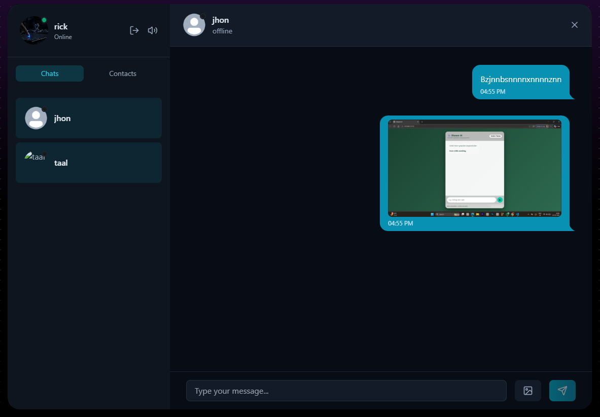

# VibeVeil

VibeVeil is a full-stack real-time chat application with a React + Vite frontend and an Express + Socket.IO backend.

## Architecture

- Frontend: React (Vite), TailwindCSS, Zustand, Socket.IO client
- Backend: Express, Socket.IO, MongoDB (Mongoose), JWT auth
- Media/Email Integrations: Cloudinary, Resend

## Monorepo Layout

This repository is organized into two main apps:

- `frontend/`: client application
- `backend/`: API server and realtime gateway

## Getting Started

### 1. Install dependencies

From the repository root:

```bash
npm install --prefix backend
npm install --prefix frontend
```

### 2. Run in development

Backend:

```bash
npm run dev --prefix backend
```

Frontend:

```bash
npm run dev --prefix frontend
```

### 3. Production run (root scripts)

Build frontend and install app dependencies:

```bash
npm run build
```

Start backend:

```bash
npm run start
```

## Available Scripts

### Root (`package.json`)

- `npm run build`: installs backend and frontend dependencies, then builds frontend
- `npm run start`: starts backend server

### Backend (`backend/package.json`)

- `npm run dev --prefix backend`: starts backend with nodemon
- `npm run start --prefix backend`: starts backend with node

### Frontend (`frontend/package.json`)

- `npm run dev --prefix frontend`: starts Vite dev server
- `npm run build --prefix frontend`: creates production build
- `npm run preview --prefix frontend`: previews production build
- `npm run lint --prefix frontend`: runs ESLint

## Page Views

Use this section to showcase key screens of the application.

### Login Page


### Signup Page


### Chat Page

Add your chat page screenshot and update the path below.

```md

```

### Profile / Settings Page

Add your profile/settings page screenshot and update the path below.

```md

```

## Complete File Structure

```text
VibeVeil/
|-- .gitignore
|-- package.json
|-- README.md
|-- backend/
|   |-- .env
|   |-- package-lock.json
|   |-- package.json
|   `-- src/
|       |-- server.js
|       |-- controllers/
|       |   |-- auth.controller.js
|       |   `-- message.controller.js
|       |-- emails/
|       |   |-- emailHandlers.js
|       |   `-- emailTemplates.js
|       |-- lib/
|       |   |-- arcjet.js
|       |   |-- cloudinary.js
|       |   |-- db.js
|       |   |-- env.js
|       |   |-- resend.js
|       |   |-- socket.js
|       |   `-- utils.js
|       |-- middleware/
|       |   |-- arcjet.middleware.js
|       |   |-- auth.middleware.js
|       |   `-- socket.Auth.Middleware.js
|       |-- models/
|       |   |-- Message.js
|       |   `-- User.js
|       `-- routes/
|           |-- auth.route.js
|           `-- message.route.js
`-- frontend/
    |-- .env
    |-- .gitignore
    |-- eslint.config.js
    |-- index.html
    |-- package-lock.json
    |-- package.json
    |-- postcss.config.js
    |-- README.md
    |-- tailwind.config.js
    |-- vite.config.js
    |-- public/
    |   |-- avatar.png
    |   |-- login.png
    |   |-- signup.png
    |   |-- vite.svg
    |   `-- sound/
    |       |-- keystroke1.mp3
    |       |-- keystroke2.mp3
    |       |-- keystroke3.mp3
    |       |-- keystroke4.mp3
    |       |-- mouse-click.mp3
    |       `-- notification.mp3
    `-- src/
        |-- App.jsx
        |-- index.css
        |-- main.jsx
        |-- components/
        |   |-- ActiveTabSwitch.jsx
        |   |-- BorderAnimatedContainer.jsx
        |   |-- ChatContainer.jsx
        |   |-- ChatHeader.jsx
        |   |-- ChatsList.jsx
        |   |-- ContactList.jsx
        |   |-- MessageInput.jsx
        |   |-- MessagesLoadingSkeleton.jsx
        |   |-- NoChatHistoryPlaceholder.jsx
        |   |-- NoChatsFound.jsx
        |   |-- NoConversationPlaceholder.jsx
        |   |-- PageLoader.jsx
        |   |-- ProfileHeader.jsx
        |   `-- UsersLoadingSkeleton.jsx
        |-- hooks/
        |   `-- useKeyboardSound.js
        |-- lib/
        |   `-- axios.js
        |-- pages/
        |   |-- ChatPage.jsx
        |   |-- LoginPage.jsx
        |   `-- SignUpPage.jsx
        `-- store/
            |-- useAuthStore.js
            `-- useChatStore.js
```

## Notes

- Keep secrets in `.env` files and avoid committing sensitive values.
- On Windows PowerShell, use `npm.cmd` if execution policy blocks `npm`.

## Clone This Repository

Use one of the following commands to clone the project locally:

```bash
git clone https://github.com/srijan7044/Vibe-Veil.git
```

Or with SSH:

```bash
git clone git@github.com:srijan7044/Vibe-Veil.git
```

Then move into the project folder:

```bash
cd Vibe-Veil
```

After cloning, install dependencies and start development:

```bash
npm install --prefix backend
npm install --prefix frontend
npm run dev --prefix backend
npm run dev --prefix frontend
```
